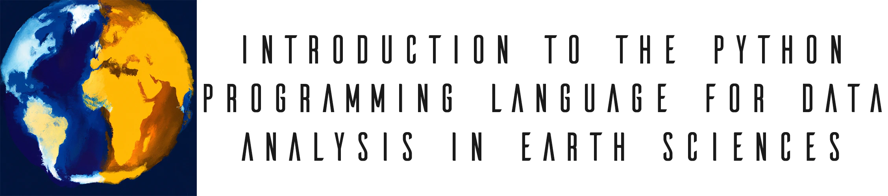
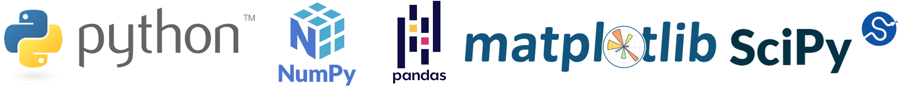

# 

This is an introductory course to the Python programming language for data analysis using examples from the earth sciences. This course aims to give an overview (breadth rather than depth) of the Python programming language and the main scientific analysis libraries to start using it in your workflow and add a new free scientific analysis tools to your portfolio. The principles of the course are as follows:

- establishing a solid language foundation 

- learning by doing (focus on practice)

- top-down teaching approach

  

> ⚠️ At the moment, this repository contains the unfinished walkthrough notebooks used to guide the course but no other detailed explanations (i.e. slides) or the solutions to the exercises. The course will be free but I have not yet decided whether I will make the whole course completely open or not. In any case, the walkthrough notebooks will have explanations to be easily understood (self-contained) so anyone can use them to learn about the topic.

## Walkthrough notebooks and notes (🚨 in development!)

- [Installing Python](https://github.com/marcoalopez/Python_course/blob/main/notebooks/installing_Python.md)

- [The Python programming language: getting started](https://deepnote.com/viewer/github/marcoalopez/Python_course/blob/main/notebooks/Python_walkthrough.ipynb) (almost done)
- [Matplotlib overview: the scientific plotting library ](https://deepnote.com/viewer/github/marcoalopez/Python_course/blob/main/notebooks/Matplotlib_walkthrough.ipynb) (in development)
- [Numpy ("numerical Python") overview](https://deepnote.com/viewer/github/marcoalopez/Python_course/blob/main/notebooks/Numpy_walkthrough.ipynb) (in development)
- [Pandas overview](https://deepnote.com/viewer/github/marcoalopez/Python_course/blob/main/notebooks/Pandas_walkthrough.ipynb) (TODO)
- Some Scipy ("scientific Python") examples (TODO)
- [Object-oriented Python for sciences: the basics](https://deepnote.com/viewer/github/marcoalopez/Python_course/blob/main/notebooks/OOP4science_walkthrough.ipynb) (TODO)

## Prerequisites

The course assumes no previous knowledge of the Python or any other programming language. We assume that the reader is familiar with basic linear algebra and statistics.

## FAQ

#### What is this course not about?

This is not a Python course on image analysis, geochemistry, machine learning or any other specific topic that you can think of. Although you will find examples of different topics during the course, it is aimed at giving an overview of the language and the Python scientific ecosystem so that you can start using it and go deeper into the topic you want. Nor is it a course where you will learn all the details and machinery behind the Python language. Python is simply the programming tool of choice for data analysis because it is free, easy to learn, and a great tool to introduce people to the world of scientific programming.

## Author

[Marco A. Lopez-Sanchez](https://marcoalopez.github.io/) is an associate researcher in the Department of Geology at the University of Oviedo. Marco is an expert in the analysis of the microstructure and texture (CPO) of solid materials, in particular with the backscattered electron diffraction technique (SEM-EBSD), the design of experiments with _in situ_ monitoring, and image analysis from different microscopy sources. He also has extensive experience in programming and code development for data analysis (https://github.com/marcoalopez). His main line of research is the study of the links between the mechanical properties (elastic, plastic and/or brittle) of rocks and their mineral composition, microstructure and crystallographic orientation of their components and seismic modelling (elastic properties) of rocks using averaging schemes and reconstruction of the microstructure and texture.

## Feedback

The GitHub website hosting the project provides several options (you will need a GitHub account, it’s free!):

- Open a [discussion](https://github.com/marcoalopez/Python_course/discussions): This is a place to:
  - Ask questions you are wondering about.
  - Share ideas.
  - Engage with the developers (still just me).

Besides, if you want to contribute to the project, you might want to glimpse at the [code of conduct](https://github.com/marcoalopez/Python_course/blob/main/CODE_OF_CONDUCT.md) (TLDR: be nice to others 😉).  

## Acknowledgements

TODO

## License

All the notebooks are licensed under a [Creative Commons Attribution-NonCommercial-ShareAlike 4.0 International License](http://creativecommons.org/licenses/by-nc-sa/4.0/).

---

*Copyright © 2022 Marco A. Lopez-Sanchez*  

*Information presented on this website and the notebooks is provided without any express or implied warranty and may include technical inaccuracies or typing errors; the author reserve the right to modify or enhance the content of this website as well as the notebooks at any time without previous notice. This webpage and the notebooks are not liable for the content of external links. Notebook contents under [Creative Commons Attribution license CC-BY 4.0](https://creativecommons.org/licenses/by/4.0/) and codes under [Mozilla Public License 2.0](https://www.mozilla.org/en-US/MPL/2.0/).*

*Hosted on GitHub Pages — This website was created with [Typora](https://typora.io/)*
